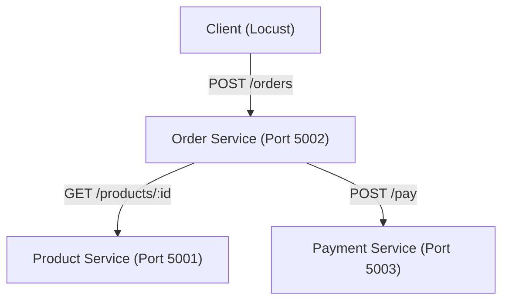

# Cloud Computing Lab Evaluation

## Containerized Microservice Application with Workload and Performance Analysis

### 1. Objective

The objective of this project is to develop and evaluate a microservice-based application consisting of three independent services. The services are containerized using Docker and deployed through Docker Compose.

The project focuses on inter-service communication, workload generation, resource monitoring, and performance analysis under different levels of concurrent users.

---

### 2. Application Description

The application implements a basic **e-commerce checkout backend** using three microservices:

* **Order Service**
* **Product Service**
* **Payment Service**

A client sends an order containing a product ID and quantity. The Order Service coordinates the complete transaction by first obtaining product information from the Product Service and then sending the calculated amount to the Payment Service for processing.

This architecture demonstrates how independent services can work together to complete a single request.

---

### 3. Microservices

#### Order Service

The Order Service functions as the main coordinator of the application.

**Endpoints:**

* `POST /orders` – Creates a new order.
* `GET /orders` – Returns the list of existing orders.

For every new order, it contacts the Product Service to obtain the product price and then communicates with the Payment Service to process the calculated payment.

#### Product Service

The Product Service is responsible for maintaining product information.

**Endpoints:**

* `GET /products` – Displays all available products.
* `GET /products/<product_id>` – Returns information for a particular product.

#### Payment Service

The Payment Service handles payment processing.

**Endpoint:**

* `POST /pay` – Accepts an order ID and payment amount and returns the simulated payment status.

---

### 4. System Architecture



All three services are connected through the Docker Compose `app-network` bridge network.

The services communicate internally using their Docker service names rather than `localhost`.

For example:

```text
http://product-service:5001
```

---

### 5. Tools and Technologies

| Component               | Technology        |
| ----------------------- | ----------------- |
| Backend                 | Python with Flask |
| Containerization        | Docker            |
| Container Orchestration | Docker Compose    |
| Load Testing            | Locust            |
| Data Processing         | Pandas            |
| Graph Generation        | Matplotlib        |
| Resource Monitoring     | Docker Stats      |

---

### 6. Project Directory Structure

The project contains the following major files and directories:

```text
project/
│
├── order_service/
│   ├── app.py
│   ├── Dockerfile
│   └── requirements.txt
│
├── product_service/
│   ├── app.py
│   ├── Dockerfile
│   └── requirements.txt
│
├── payment_service/
│   ├── app.py
│   ├── Dockerfile
│   └── requirements.txt
│
├── docker-compose.yml
├── locustfile.py
├── run_tests.py
├── plot.py
├── results.csv
├── results/
└── README.md
```

**File descriptions:**

* `order_service/` – Implementation files for the Order Service.
* `product_service/` – Implementation files for the Product Service.
* `payment_service/` – Implementation files for the Payment Service.
* `docker-compose.yml` – Defines containers, ports, networks, and service dependencies.
* `locustfile.py` – Defines the Locust workload behavior.
* `run_tests.py` – Automates testing for different concurrency levels.
* `plot.py` – Creates performance graphs from the collected results.
* `results.csv` – Stores the final experimental measurements.
* `results/` – Contains intermediate testing data and summaries.
* `README.md` – Project documentation.

---

### 7. Microservice Implementation

Each service is implemented as an independent Flask application.

The **Order Service** runs on port `5002` and acts as the orchestrator. It receives client requests and communicates with the Product and Payment services using HTTP requests.

The **Product Service** runs on port `5001` and provides product information.

The **Payment Service** runs on port `5003` and handles the simulated payment operation.

This separation allows each service to operate independently while still participating in the overall checkout workflow.

---

### 8. Docker Configuration

Each microservice has its own Dockerfile.

The containers use a lightweight Python image such as:

```text
python:3.9-slim
```

The Dockerfiles copy the application files into the container, install the required dependencies, and configure the application to start when the container launches.

As a result, the three services can be packaged and executed as separate Docker containers.

---

### 9. Docker Compose Setup

Docker Compose is used to start and manage all three services together.

The configured ports are:

| Service         |   Port |
| --------------- | -----: |
| Product Service | `5001` |
| Order Service   | `5002` |
| Payment Service | `5003` |

A custom Docker bridge network named `app-network` is used for communication between containers.

The Order Service also contains a `depends_on` configuration so that the Product and Payment services are started before it.

---

### 10. Communication Between Services

The Order Service communicates with the other services through the Docker network.

Instead of using `localhost`, Docker service names are used as hostnames.

The main internal requests are:

```text
GET  http://product-service:5001/products/<id>
POST http://payment-service:5003/pay
```

This allows the containers to communicate directly within the Docker network.

---

### 11. Main API Used for Testing

The primary endpoint used during the workload experiment is:

```text
POST /orders
```

It is exposed by the Order Service on port `5002`.

A sample request body is:

```json
{
    "product_id": 1,
    "quantity": 2
}
```

The Order Service uses this information to obtain the product price and subsequently initiate the payment request.

---

### 12. Load Testing

**Locust** was used to evaluate the application under different concurrent workloads.

The `locustfile.py` continuously sends `POST /orders` requests. No waiting time is introduced between requests:

```text
wait_time = constant(0)
```

This creates continuous traffic and allows the behavior of the application to be observed as the number of concurrent users increases.

During the tests, response time, throughput, failed requests, CPU usage, and memory usage were recorded.

---

### 13. Workload Levels

Five different concurrency levels were tested using the automated `run_tests.py` script.

| Workload | Concurrent Users |
| -------- | ---------------: |
| W1       |                1 |
| W2       |                2 |
| W3       |                4 |
| W4       |                8 |
| W5       |               16 |

Each workload was executed for **30 seconds**.

A **10-second cooldown period** was used between consecutive workloads to give the system time to stabilize.

During testing, Locust recorded application performance metrics while a background process periodically collected Docker container statistics.

---

### 14. Performance Results

| Workload | Concurrency | Avg Response Time (ms) | P95 (ms) | Throughput (req/s) | Failed | Order CPU (%) | Payment CPU (%) | Product CPU (%) | Order Memory (MiB) | Payment Memory (MiB) | Product Memory (MiB) |
| -------- | ----------: | ---------------------: | -------: | -----------------: | -----: | ------------: | --------------: | --------------: | -----------------: | -------------------: | -------------------: |
| W1       |           1 |                  15.06 |       19 |              65.67 |      0 |         36.32 |           11.59 |           11.15 |              50.04 |                41.43 |                41.13 |
| W2       |           2 |                  24.39 |       38 |              80.80 |      0 |         55.42 |           17.74 |           16.40 |              54.32 |                42.80 |                41.59 |
| W3       |           4 |                  42.56 |       68 |              92.37 |      0 |         90.66 |           25.24 |           23.46 |              58.12 |                44.20 |                42.04 |
| W4       |           8 |                  84.76 |      140 |              93.24 |      0 |         95.34 |           23.96 |           22.40 |              62.41 |                45.30 |                42.34 |
| W5       |          16 |                 166.54 |      260 |              95.09 |      0 |        101.05 |           25.81 |           23.22 |              66.81 |                46.62 |                42.59 |

---

### 15. Performance Graphs

#### 1. Response Time vs Concurrency


**Observation:**
Average response time rises from **15.06 ms** with one concurrent user to **166.54 ms** with sixteen users. The increase becomes considerably larger at higher concurrency.

---

#### 2. Throughput vs Concurrency


**Observation:**
Throughput increases from **65.67 req/s** at one user to **92.37 req/s** at four users. Beyond this point, the throughput remains almost constant, reaching approximately **93–95 req/s** for 8 and 16 concurrent users.

This indicates that the system is approaching its throughput limit under the tested configuration.

---

#### 3. CPU Utilization vs Concurrency


**Observation:**
The Order Service consumes considerably more CPU compared with the Product and Payment services.

Its CPU utilization reaches approximately **101%** at 16 concurrent users.

Docker CPU percentages can exceed 100% because the measurement may represent usage relative to a single CPU core in a multi-core system.

---

#### 4. Memory Utilization vs Concurrency


**Observation:**
The memory usage of the Order Service increases from **50.04 MiB** at W1 to **66.81 MiB** at W5.

The Product and Payment services show comparatively smaller changes in memory consumption.

---

### 16. Performance Analysis

#### Response Time

Increasing the number of concurrent users results in a significant increase in response time. This indicates that the application experiences greater processing contention as more requests arrive simultaneously.

#### Throughput

Throughput improves when the workload initially increases. However, after approximately four concurrent users, the improvement becomes very small.

This suggests that the system is approaching a saturation point under the current configuration.

#### CPU and Memory

CPU utilization increases with workload, particularly for the Order Service.

Memory usage also rises gradually, with the Order Service showing the largest overall increase.

#### Reliability

No failed requests were recorded during any of the five workload tests. The application therefore remained stable throughout the tested concurrency levels.

---

### 17. Bottleneck Analysis

The **Order Service** is the main observed resource bottleneck.

It acts as the central coordinator and must handle the incoming client request while also communicating with both the Product and Payment services.

Because of this additional orchestration work, the Order Service shows:

* The highest CPU utilization.
* The highest memory consumption.
* Increasing response time as concurrency increases.

At 16 concurrent users, its CPU utilization reaches approximately **101%**, while the other services remain significantly lower.

Therefore, optimization of the Order Service would be the primary area to investigate for improving overall system performance.

---

### 18. Conclusion

The project successfully demonstrates a containerized e-commerce backend consisting of three independent microservices.

Docker Compose was used to deploy the services and establish communication through a dedicated Docker bridge network. Locust was then used to generate different workload levels and evaluate application performance.

The experiment shows that increasing concurrency leads to higher response times and greater CPU utilization. Throughput improves initially but eventually approaches a plateau.

Among the three services, the **Order Service** was identified as the main observed bottleneck because it performs the orchestration between the client, Product Service, and Payment Service.

Despite the increase in workload, **no request failures were observed** during the experiments, demonstrating stable behavior across the tested workload levels.

---

### 19. How to Run the Project

#### Step 1: Build and start the containers

```bash
docker compose up --build -d
```

#### Step 2: Check the running containers

```bash
docker compose ps
```

#### Step 3: Test the Order API

```bash
curl -X POST http://localhost:5002/orders -H "Content-Type: application/json" -d '{"product_id": 1, "quantity": 2}'
```

#### Step 4: Run the workload experiment

This step is optional and generates a new `results.csv` file.

```bash
python run_tests.py
```

#### Step 5: Generate the performance graphs

```bash
python plot.py
```

---

### 20. Evaluation and Demonstration Procedure

During the laboratory evaluation, the project can be demonstrated in the following order:

1. Display the complete project directory structure.
2. Explain the Dockerfiles for each microservice.
3. Start the application using Docker Compose.
4. Run `docker compose ps` and show the active containers.
5. Demonstrate an API request using `curl` or Postman.
6. Explain the Docker network configured in `docker-compose.yml`.
7. Show how the Order Service communicates with the Product and Payment services.
8. Open `locustfile.py` and explain the workload generation process.
9. Display the generated `results.csv`.
10. Explain the performance observation table.
11. Display the four performance graphs.
12. Discuss the response-time and throughput trends.
13. Explain the CPU and memory utilization results.
14. Identify the Order Service as the primary observed bottleneck.
15. Highlight that no request failures occurred during the workload tests.

---

## Summary

The experiment demonstrates the practical use of **Docker, Docker Compose, Flask, and Locust** for building and evaluating a containerized microservice application.

The results show a clear relationship between workload and system performance: higher concurrency increases response time and resource usage, while throughput eventually reaches a near-stable level. The Order Service requires the greatest amount of resources and represents the primary performance bottleneck in the tested architecture.
