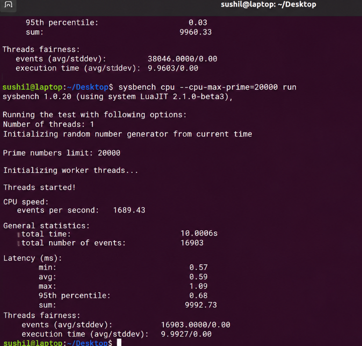

# Lab 1: Performance Evaluation of a Type-1 Hypervisor Using Proxmox VE

## Overview

Proxmox VE is an open-source Type-1 hypervisor that runs directly on physical hardware. This experiment involves creating and configuring an Ubuntu virtual machine using the Proxmox VE web interface. System resources are verified, and CPU performance is evaluated using Sysbench to study the performance of bare-metal virtualization.

---

## 1. Virtual Machine Configuration

| Parameter | Configuration |
|---|---|
| Hypervisor | Proxmox VE |
| Hypervisor Type | Type-1 (Bare-metal) |
| Node | Proxmox Node (pve) |
| VM Name | CC-Experiment1-Type1 |
| Guest OS | Ubuntu Linux (64-bit) |
| ISO Image | ubuntu-22.04.iso |
| CPU Allocation | 2 vCPUs (1 Socket, 2 Cores) |
| Memory | 2048 MiB (2 GB RAM) |
| Disk Storage | 20 GB (local-lvm) |
| Network | vmbr0 (VirtIO) |

---

## 2. System Resource Verification

### 2.1 Hostname and Operating System

**Command:**
```bash
hostnamectl
```


### 2.2 CPU Configuration

**Command:**
```bash
lscpu
```


### 2.3 Memory Configuration

**Command:**
```bash
free -h
```


### 2.4 Disk Storage Verification

**Command:**
```bash
df -h
```


### 2.5 Real-Time System Monitoring

**Command:**
```bash
top
```


---

## 3. CPU Performance Benchmark Using Sysbench

Sysbench is used to evaluate CPU performance by measuring computational throughput, execution time, and latency.

### Installation

```bash
sudo apt update
sudo apt install sysbench -y
sysbench --version
```

### Benchmark Execution

```bash
sysbench cpu --cpu-max-prime=20000 run
```

### Benchmark Output



---

## 4. Observations and Results

The following table summarizes the results obtained from the CPU benchmark executed inside the Ubuntu virtual machine.

| Parameter | Observed Value |
|---|---:|
| Hypervisor | Proxmox VE |
| Hypervisor Type | Type-1 |
| Guest Operating System | Ubuntu |
| CPU Allocation | 2 vCPUs |
| Memory Allocation | 2 GB |
| Disk Allocation | 20 GB |
| Total Execution Time | 10.0006 s |
| Total Events | 16,903 |
| Events per Second | 1689.43 |
| Minimum Latency | 0.57 ms |
| Average Latency | 0.59 ms |
| Maximum Latency | 1.09 ms |

---

## 5. Experimental Workflow

1. Connect to the designated network and open the Proxmox VE web interface at `https://<PROXMOX_SERVER_IP>:8006`.
2. Log in using the authorized credentials and select the appropriate authentication realm.
3. Navigate to **Datacenter → pve** and launch the Create VM wizard.
4. Configure the Ubuntu ISO, system settings, disk (20 GB), CPU (2 vCPUs), memory (2048 MiB), and network (vmbr0).
5. Review the configuration and create the virtual machine.
6. Start the VM, open the noVNC console, complete the Ubuntu installation, and reboot.
7. Log in to the terminal and verify the system configuration using `hostnamectl`, `lscpu`, `free -h`, and `df -h`.
8. Install Sysbench and execute the CPU benchmark.
9. Record the performance statistics and monitor resource utilization through the Proxmox summary dashboard.
10. Gracefully shut down the virtual machine after completing the experiment.

---

## Conclusion

The experiment demonstrates the creation and configuration of an Ubuntu virtual machine on Proxmox VE. System resources were verified, and Sysbench was used to measure CPU performance through execution time, event throughput, and latency.
